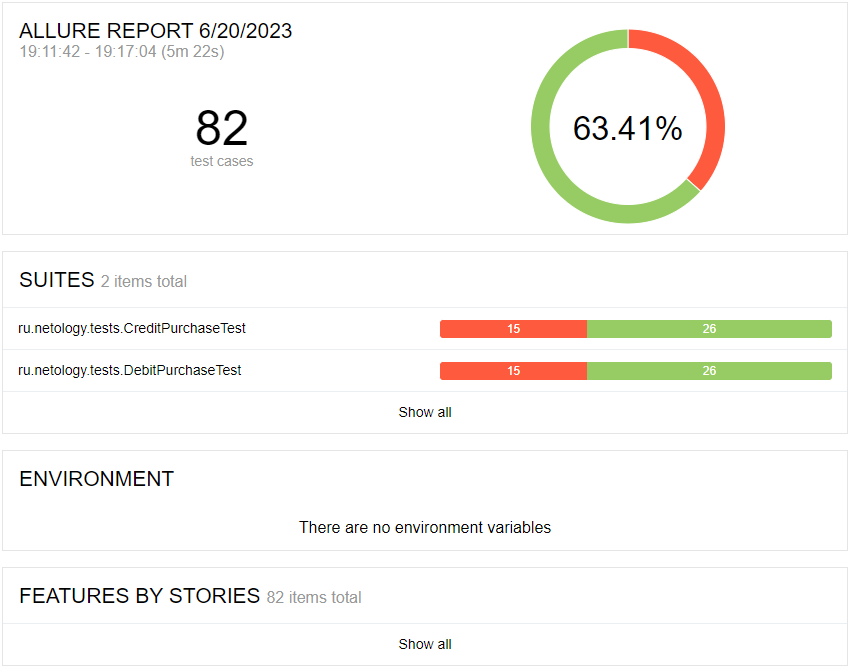
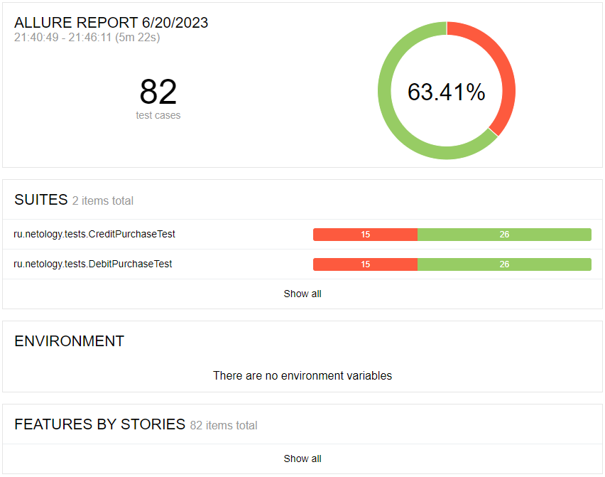

## Отчёт по итогам автоматизированного тестирования

### Краткое описание

В соответствии с [планом](https://github.com/Ilya8721/AutomationQA_Diploma/blob/main/Documentation/Plan.md) было проведено автоматизированное тестирование веб-сервиса покупки туров.

- В ходе автоматизации тестирования были реализованы позитивные и негативные сценарии;
- Реализована поддержка двух баз данных - MySQL и PostgreSQL;
- Протестирована возможность сохранения информации о платеже и успешности его проведения в БД.

### Тест-кейсы

Общее количество тест-кейсов - 80:

- Оплата по дебетовой карте - 41 (позитивных - 1, негативных - 40)
- Оплата по кредитной карте - 42 (позитивных - 1, негативных - 40)

### Результаты выполнения автотестов:

#### При подключении к СУБД MySQL

* 26 - успешных, что составляет 63.41%
* 15 - не прошло, что составляет 36.59%

#### При подключении к СУБД PostgreSQL

* 26 - успешных, что составляет 63.41%
* 15 - не прошло, что составляет 36.59%

### Общие рекомендации

#### По результатам тестирования необходимо:

- Составить документацию для приложения;
- Исправить найденные ошибки:

1) [Успешная покупка тура с номером карты статус которой declined](https://github.com/Ilya8721/AutomationQA_Diploma/issues/1)
2) [Возможна отправка формы с значением месяца 00](https://github.com/Ilya8721/AutomationQA_Diploma/issues/2)
3) [Отсутствует проверка валидации поля "Владелец" при заполнении формы покупки тура](https://github.com/Ilya8721/AutomationQA_Diploma/issues/3)
4) [Ошибка валидации поля "Владелец" при отправке формы с пустым полем CVC/CVV](https://github.com/Ilya8721/AutomationQA_Diploma/issues/4)
5) [Сообщение при отправке формы с пустым полем "Номер карты" содержит неверный текст](https://github.com/Ilya8721/AutomationQA_Diploma/issues/5)
6) [Сообщение при отправке формы с пустым полем "Месяц" содержит неверный текст](https://github.com/Ilya8721/AutomationQA_Diploma/issues/6)
7) [Сообщение при отправке формы с пустым полем "Год" содержит неверный текст](https://github.com/Ilya8721/AutomationQA_Diploma/issues/7)
8) [Сообщение при отправке формы с пустым полем "CVC/CVV" содержит неверный текст](https://github.com/Ilya8721/AutomationQA_Diploma/issues/8)
9) [Сообщения об ошибке полей ввода не исчезают после введения корректных данных](https://github.com/Ilya8721/AutomationQA_Diploma/issues/9)
